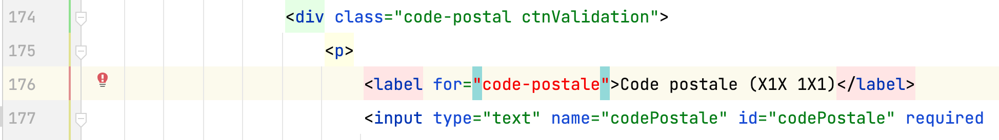

# Grille d'évaluation pour le TP3
## Structure, sémantique, accessibilité, API des formulaires HTML5
- [X] __Regrouper les éléments de formulaire de même nature__ (1 point)
    - Utiliser des `<fieldsets>`
    - Faire des groupes d’`<option>`s dans une liste déroulante
- [X] __Étiqueter__ (.8/1 point)
    - Étiqueter les groupes d’éléments de formulaire
    - Nommer chaque groupe avec une `<legend>`
    - Étiqueter un groupe d’`<option>`s d’une liste déroulante
    - Étiqueter avec un `<label>` les champs de formulaire
- [X] __Tester l'accessibilité__ (.85/1 point)
    - Rendre (garder) le formulaire navigable au clavier
    - Baliser avec précision les éléments de formulaire
    - Bien choisir le type du `<input>`
    - Code sémantique et valide pour l’ensemble du document
- [X] __Ajouter des containtes de saisie__ (.9/1 point)
    - Identifier par un attribut approprié les champs obligatoires du formulaire
    - Ajouter des contraintes de saisie sur les champs de formulaire

## Styles CSS
- [X] __Aligner les éléments de formulaire__ (1 point)
    - Contrôler les espacements
- [X] __Intégrer tous les contenus__  (1 point)
    - Selon les guides visuels (ou mieux !)
- [X] __Styler l’interactivité__  (0.85/1 point)
    - État focus, état checked des éléments de formulaires
    - États des hyperliens (link, visited, hover, active)
    - Styler les messages d’erreur
    - Utiliser des sprites CSS
- [X] __Styler les boutons radio__  (1 point)
    - en les gardant accessibles au clavier

## Méthodes de travail favorisant la collaboration
- [X] __Organiser et documenter la feuille de styles__  (1 point)
- [X] __Utiliser le contrôle des versions GIT__  (1 point)
    - Un minimum de 3 commits est attendu pour les étapes html, css, contrôle qualité finale

## Note et commentaires
 9.4/10 

- Excellent travail d'intégration.
- Bonne appropriation du versionnage!
- Parmi les quelques [erreurs html](images/erreurs-html.pdf)
  - une erreur de *grammaire* fréquemment répétée est la présence d'un attribut `src` plutôt que `srcset` dans les balises `<picture>`
  - un étiquetage incorrect  

  
- Les contraintes de saisie sur l'indicatif et le numéro de téléphone pourrait être renforcées par un pattern car il est possible actuellement de valider des lettres au lieu des chiffres.

### CSS
- Il manquait les styles pour l'état focus des boutons radio.
Voir la correction dans le code du commit d'évaluation.

## Barème
| Barème | sur 1 |
|--------|-------|
| A+     | 1     |
| A      | 0.95  |
| B+     | 0.9   |
| B      | 0.85  |
| C+     | 0.8   |
| C      | 0.75  |
| D      | 0.65  |
